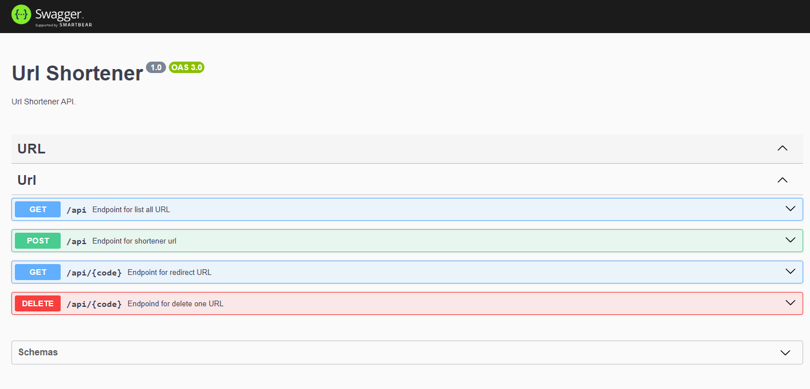

# 🚀 API to short URLs

#### :memo: This project was develop with

- [NodeJs](https://nodejs.org/en/docs)
- [NestJs](https://docs.nestjs.com/)
- [Postgres](https://www.postgresql.org/)
- [Docker](https://docs.docker.com/)
- [Swagger](https://swagger.io/docs/)

#### :heavy_check_mark: Print of documentation OpenApi create of swagger



# Author

Developed with :heart: **danielveloso97** :man_technologist: my social media [Linkedin](https://www.linkedin.com/in/daniel-silva-bab1591a6/)

## Installation

```bash
$ yarn install
```

## Running the app

```bash
# development
$ yarn run start

# watch mode
$ yarn run start:dev

# production mode
$ yarn run start:prod
```

## Test

```bash
# unit tests
$ yarn test

# test coverage
$ yarn run test:cov
```

## Insomnia Collection

[](https://insomnia.rest/run/?label=shortenerurl&uri=https://github.com/danielveloso97/url-shortener/.github/insomnia_Collections.json)
